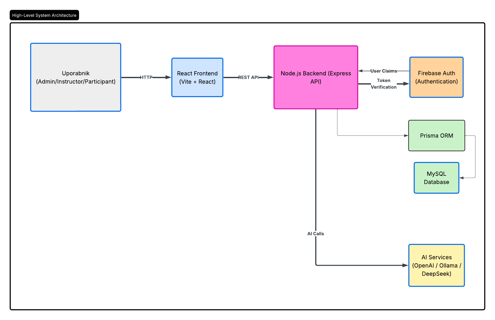
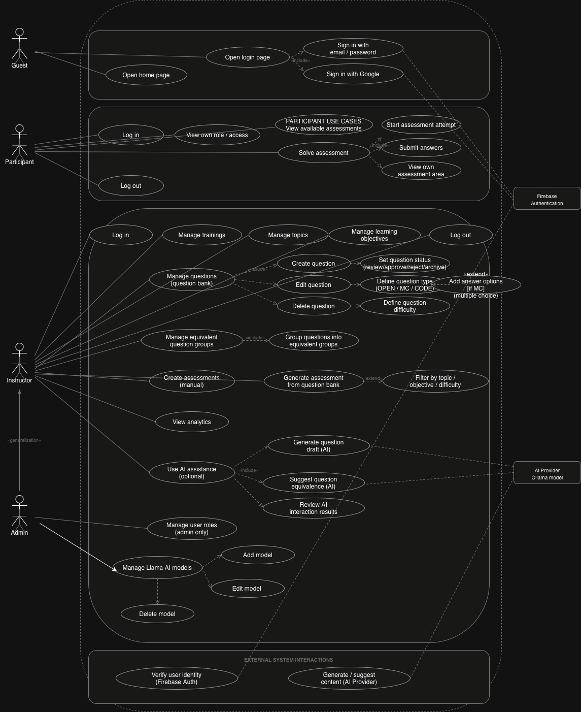

# PROJEKT3

PROJEKT3 je platforma za preverjanje znanja na področju informatike in računalništva. Podpira lastništvo in včlanjevanje v treninge, banko vprašanj, pripravo assessmentov, reševanje za udeležence, ocenjevanje, analitiko in izbirne funkcionalnosti z lokalnimi modeli.

Repozitorij je razdeljen na dve aktivni aplikaciji:

- `frontend-next/` — SPA aplikacija s TanStack Routerjem, React 19, TypeScript, Tailwind v4
- `backend/` — Express, Prisma, MySQL, Firebase Admin

Na korenu repozitorija ni enotnega zaganjalnika. Frontend in backend je treba namestiti ter poganjati ločeno.

## Gostovanje

Trenutna gostovana postavitev:

- frontend je objavljen na Vercelu
- podatkovna baza gostuje na Railwayu

Za lokalni razvoj frontend in backend še vedno tečeta ločeno na tvojem računalniku.

## Kaj aplikacija trenutno omogoča

### Inštruktor

- upravljanje treningov, udeležencev, tem in vpisnih žetonov
- ustvarjanje in urejanje vprašanj
- združevanje ekvivalentnih vprašanj
- pripravo assessmentov in post-testov
- objavo, arhiviranje in pregled assessmentov
- ročno ocenjevanje odprtih in programerskih odgovorov
- pregled rezultatov, napredka udeležencev, trendov, lestvice in analize vprašanj
- uporabo funkcij za pripravo osnutkov z modeli, AI pregled in AI vpoglede

### Udeleženec

- pridružitev treningom
- pregled razpoložljivih assessmentov
- začetek in reševanje assessmentov
- enkratno oddajo odgovorov
- pregled lastnih rezultatov

### Administrator

- upravljanje uporabnikov in vlog
- vzpostavljanje treningov
- upravljanje AI modelov
- dostop do sistemske analitike

## Struktura repozitorija

```text
backend/         Express API, Prisma schema, kontrolerji, rute, testi
frontend-next/   Aktivni frontend SPA
lovable-reference/
migration_docs/
```

Ključna aktivna področja frontenda:

- `frontend-next/src/routes` — strani in varovala na nivoju rut
- `frontend-next/src/services` — domenske API storitve
- `frontend-next/src/lib` — avtentikacija, varovala rut, query ključi, helperji
- `frontend-next/src/types` — deljeni frontend modeli in enumi

Ključna aktivna področja backenda:

- `backend/routes` — registracija HTTP rut
- `backend/controllers` — poslovna logika
- `backend/middleware` — avtentikacija, vloge ter ownership/enrollment omejitve
- `backend/prisma/schema.prisma` — aktivna shema podatkovne baze
- `backend/__tests__` — API, kontrolerski in middleware testi

Dokumentacijske datoteke v `docs/`:

- `docs/DIAGRAMS.md` — Mermaid ER, use-case, sequence, lifecycle in deployment diagrami
- `docs/arhitekturni_projekt3.png` — izvožena arhitekturna slika
- `docs/DPU_2.jpg` — izvožen diagram/slikovni artefakt

## Tehnološki sklad

### Frontend

- React 19
- TypeScript 5
- TanStack Router
- TanStack Query
- Vite 7
- Tailwind CSS v4
- Recharts
- Firebase Web SDK

### Backend

- Node.js
- Express 5
- Prisma 6
- MySQL
- Firebase Admin SDK

## Zahteve

- priporočljivo Node.js 20+
- npm
- MySQL
- Firebase projekt za avtentikacijo
- po želji Ollama za podporo lokalnim modelom

## Nastavitev okolja

### Frontend

Kopiraj:

```bash
cp frontend-next/.env.example frontend-next/.env
```

Obvezne frontend env vrednosti:

- `VITE_API_URL`
- `VITE_FIREBASE_API_KEY`
- `VITE_FIREBASE_AUTH_DOMAIN`
- `VITE_FIREBASE_PROJECT_ID`
- `VITE_FIREBASE_STORAGE_BUCKET`
- `VITE_FIREBASE_MESSAGING_SENDER_ID`
- `VITE_FIREBASE_APP_ID`
- `VITE_FIREBASE_MEASUREMENT_ID`

Izbirna frontend env nastavitev:

- `VITE_DEV_ROLE_OVERRIDE`

`VITE_DEV_ROLE_OVERRIDE` omogoči razvojni predogled vlog na prijavni strani. Uporabi eno izmed vrednosti:

- `admin`
- `instructor`
- `participant`

### Backend

Kopiraj:

```bash
cp backend/.env.example backend/.env
```

Obvezne backend env vrednosti:

- `DATABASE_URL`
- Firebase Admin poverilnice, kot jih pričakuje middleware nastavitev v tvojem lokalnem `.env`

Opomba za produkcijo:

- gostovana podatkovna baza je na Railwayu
- lokalni razvoj lahko uporablja katerikoli MySQL, dokler `DATABASE_URL` kaže nanj

Backend env vrednosti, povezane z modeli:

- `AI_DEFAULT_PROVIDER`
- `AI_DEFAULT_MODEL`
- `OLLAMA_BASE_URL`
- `OLLAMA_TIMEOUT_MS`

## Nastavitev podatkovne baze

Aktivna Prisma shema je:

- `backend/prisma/schema.prisma`

Če lokalno postavljaš podatkovno bazo od začetka, je praktičen potek tak:

```bash
cd backend
npx prisma db push
node prisma/seed.js
```

Če delaš z migracijskim/cutover gradivom, poglej:

- `backend/prisma/phase0/README.md`
- `migration_docs/`

## Namestitev

### Backend

```bash
cd backend
npm install
```

### Frontend

```bash
cd frontend-next
npm install
```

## Lokalni zagon

Najprej zaženi backend:

```bash
cd backend
npm run dev
```

API teče na:
API teče na:

- `http://localhost:3000`

Nato zaženi frontend:

```bash
cd frontend-next
npm run dev
```

Frontend teče na:

- `http://localhost:8080`

Gostovani frontend:

- objavljen na Vercelu

## Avtentikacija in vloge

Frontend uporablja Firebase avtentikacijo in nato kliče:

- `GET /auth/me`

da razreši avtoritativno backend vlogo.

Frontend varovala rut so v:

- `frontend-next/src/lib/route-guards.ts`

Navigacija po vlogah v UI je definirana v:

- `frontend-next/src/components/layout/SidebarNav.tsx`

Mapiranje vlog v trenutnem sistemu:

- `ADMIN`
- `INSTRUCTOR`
- `PARTICIPANT`

## Backend API domene

Registrirane vrhnje API skupine:

- `/auth`
- `/users`
- `/trainings`
- `/topics`
- `/questions`
- `/equivalence-groups`
- `/assessments`
- `/assessment-attempts`
- `/analytics`
- `/ai`

## Diagrami in dokumentacija

Trenutna mapa `docs` je majhna, vendar uporabna za orientacijo:

- [docs/DIAGRAMS.md](docs/DIAGRAMS.md)
  - pregled entitet in relacij
  - pregled vlog in use-case scenarijev
  - sekvenca reševanja assessmenta
  - življenjski cikel vprašanja
  - pregled deployment topologije
- 
- 

`docs/DIAGRAMS.md` uporabljaj kot konceptualno referenco, vendar kot primarni vir pri neskladjih upoštevaj živo kodo in konfiguracijo. Posebej velja:

- aktivna shema je `backend/prisma/schema.prisma`
- runtime porti in skripte izhajajo iz `frontend-next/package.json`, `backend/package.json` in env datotek
- del diagramov še vedno vključuje legacy FAZA-0 entitete ali starejše primerjalne runtime vrednosti

## Opombe za Ollamo

Aplikacija podpira lokalne Ollama modele prek upravljanja AI modelov v uporabniškem vmesniku.

Pomembna praktična opomba:

- na nekaterih računalnikih `http://localhost:11434` in `http://127.0.0.1:11434` ne kažeta na isti Ollama runtime

Če aplikacija pravi, da model ni nameščen, čeprav ga `ollama list` prikaže, preveri model prek:

```bash
curl http://127.0.0.1:11434/api/tags
curl http://localhost:11434/api/tags
```

Po potrebi nastavi Base URL modela v UI ali pa v `backend/.env` nastavi:

```env
OLLAMA_BASE_URL=http://127.0.0.1:11434
```

## Testiranje

### Backend

```bash
cd backend
npm test
```

Obstoječi backend testi vključujejo:

- kontrolerje
- scope middleware
- integracijsko API pokritost

### Frontend

```bash
cd frontend-next
npm test
```

Uporabni validacijski ukazi:

```bash
cd frontend-next
npx tsc --noEmit
npm run build
```

## Trenutne znane omejitve

- Nekatera starejša besedila v aplikaciji še vedno omenjajo "prototype" ali "static demo data", čeprav je velik del aplikacije že povezan z realnimi storitvami.
- `docs/DIAGRAMS.md` je uporaben, vendar so deli dokumenta konceptualni in nekatere sekcije še vedno vključujejo legacy entitete ali starejše primerjalne runtime vrednosti.
- Na korenu repozitorija ni enotnega zaganjalnika; frontend in backend je treba upravljati ločeno.

## Primarni vir resnice

Za trenutno implementacijo daj prednost živi kodi in aktivni shemi pred starejšimi planskimi zapisi:

- frontend rute: `frontend-next/src/routes`
- frontend storitve: `frontend-next/src/services`
- backend rute/kontrolerji: `backend/routes`, `backend/controllers`
- aktivna shema: `backend/prisma/schema.prisma`
- env in runtime konfiguracija: `frontend-next/.env.example`, `backend/.env.example`, package skripte
