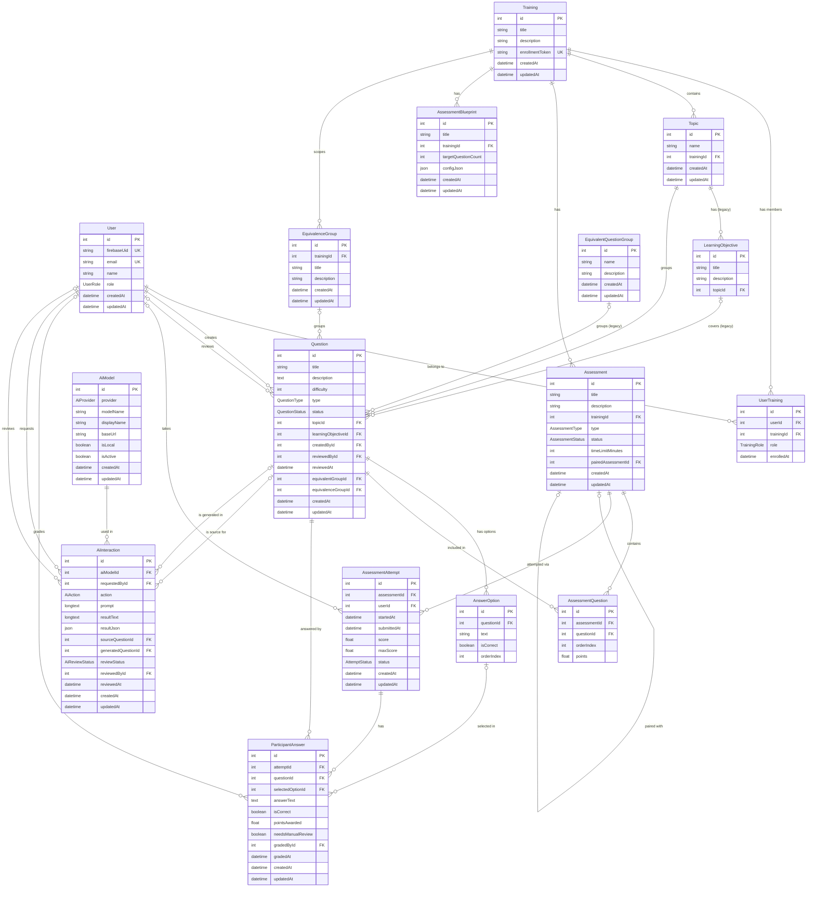
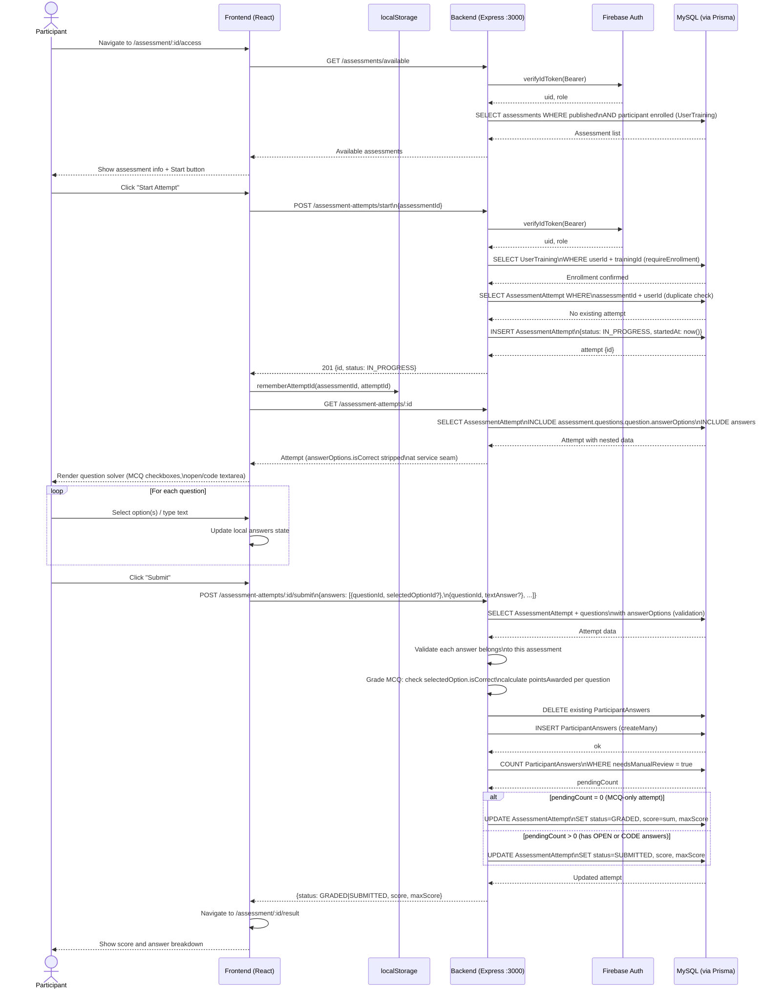
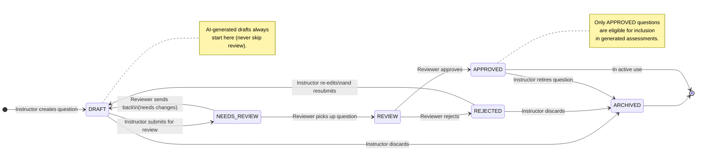
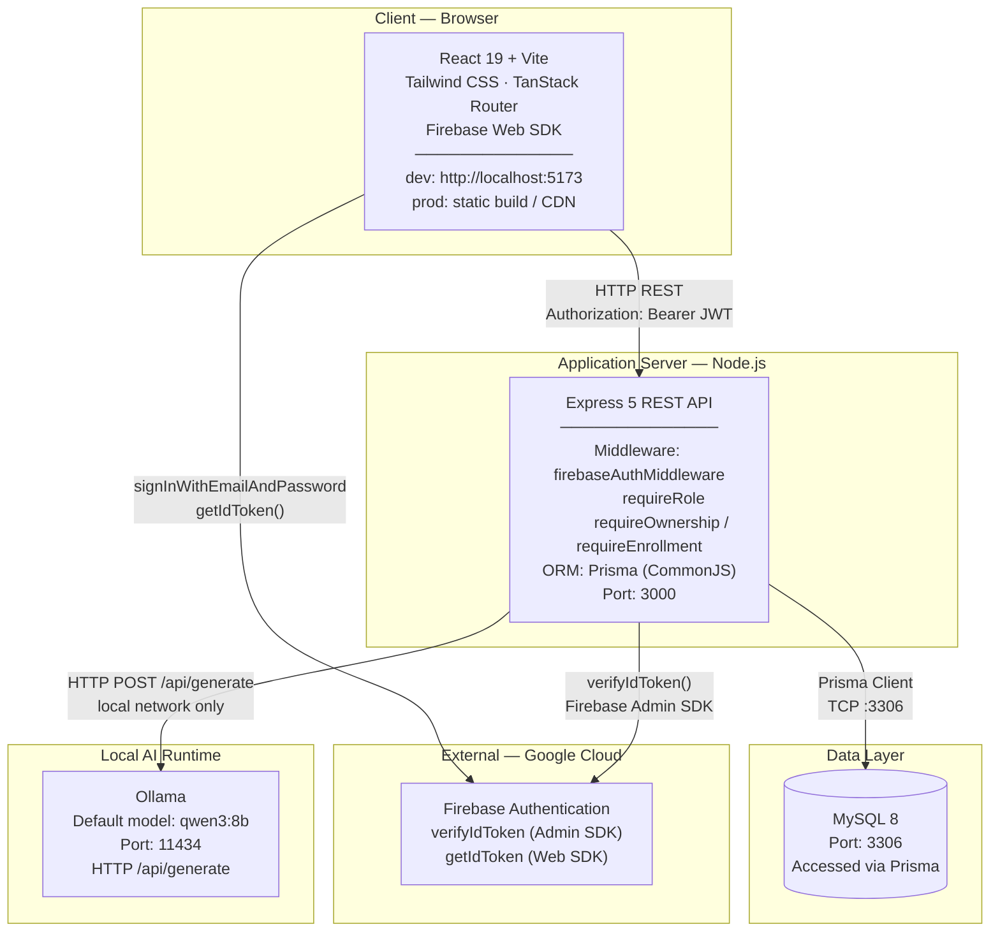

# DIAGRAMS — Projekt3

AI-assisted question and assessment management system.
All diagrams are written in Mermaid syntax.

---

## 1. Entity-Relationship Diagram

Source: `backend/prisma/schema.prisma`. Legacy FAZA-0 tables (`LearningObjective`, `EquivalentQuestionGroup`) and their relations are included and labelled accordingly.

---

## 2. Use Case Diagram

All three roles and their permitted actions across the system. Rendered as a flowchart (Mermaid has no native UML Use Case syntax).

```mermaid
flowchart LR
    ADMIN((ADMIN))
    INSTRUCTOR((INSTRUCTOR))
    PARTICIPANT((PARTICIPANT))

    subgraph SYS["System Boundary — Projekt3"]

        subgraph USR["User & System Management"]
            UC_Users["Manage Users\n(list, assign role)"]
            UC_AiModels["Manage AI Models\n(create, test, delete)"]
            UC_OllamaStatus["Check Ollama Status"]
        end

        subgraph TRN["Training Management"]
            UC_AllTrainings["View All Trainings"]
            UC_MyTrainings["View My Trainings"]
            UC_CreateTraining["Create / Edit / Delete Training"]
            UC_Members["Manage Training Members"]
            UC_Token["Generate Enrollment Token"]
            UC_Join["Enroll via QR / Token"]
        end

        subgraph CNT["Content Authoring"]
            UC_Topics["Manage Topics"]
            UC_Questions["Create / Edit / Delete Questions"]
            UC_Status["Set Question Status\n(review, approve, reject, archive)"]
            UC_EquivGroups["Manage Equivalence Groups"]
        end

        subgraph AI["AI Assistant"]
            UC_GenDraft["Generate Question Draft"]
            UC_GenEquiv["Generate Equivalent Question"]
            UC_SuggestEquiv["Suggest Question Equivalence"]
            UC_ReviewAI["Review AI Interactions\n(accept / reject)"]
            UC_Insights["View Pre/Post AI Insights"]
        end

        subgraph ASS["Assessment Management"]
            UC_GenAssess["Generate Assessment\n(pre/post/quiz)"]
            UC_ManageAssess["Publish / Archive Assessment"]
            UC_Results["View Assessment Results"]
            UC_Grade["Grade Open / Code Answers"]
            UC_Analytics["View Analytics\n(by topic, difficulty, trends)"]
            UC_Participants["View Participant Profiles"]
            UC_Leaderboard["View Leaderboard"]
        end

        subgraph PAR["Participant Flow"]
            UC_Available["View Available Assessments"]
            UC_Solve["Start & Solve Assessment"]
            UC_Submit["Submit Assessment"]
            UC_MyResults["View My Results"]
        end

    end

    ADMIN --> UC_Users
    ADMIN --> UC_AiModels
    ADMIN --> UC_OllamaStatus
    ADMIN --> UC_AllTrainings
    ADMIN --> UC_CreateTraining
    ADMIN --> UC_Members
    ADMIN --> UC_Token
    ADMIN --> UC_GenDraft
    ADMIN --> UC_GenEquiv
    ADMIN --> UC_SuggestEquiv
    ADMIN --> UC_ReviewAI

    INSTRUCTOR --> UC_MyTrainings
    INSTRUCTOR --> UC_CreateTraining
    INSTRUCTOR --> UC_Members
    INSTRUCTOR --> UC_Token
    INSTRUCTOR --> UC_Topics
    INSTRUCTOR --> UC_Questions
    INSTRUCTOR --> UC_Status
    INSTRUCTOR --> UC_EquivGroups
    INSTRUCTOR --> UC_GenDraft
    INSTRUCTOR --> UC_GenEquiv
    INSTRUCTOR --> UC_SuggestEquiv
    INSTRUCTOR --> UC_ReviewAI
    INSTRUCTOR --> UC_Insights
    INSTRUCTOR --> UC_OllamaStatus
    INSTRUCTOR --> UC_GenAssess
    INSTRUCTOR --> UC_ManageAssess
    INSTRUCTOR --> UC_Results
    INSTRUCTOR --> UC_Grade
    INSTRUCTOR --> UC_Analytics
    INSTRUCTOR --> UC_Participants
    INSTRUCTOR --> UC_Leaderboard

    PARTICIPANT --> UC_MyTrainings
    PARTICIPANT --> UC_Join
    PARTICIPANT --> UC_Available
    PARTICIPANT --> UC_Solve
    PARTICIPANT --> UC_Submit
    PARTICIPANT --> UC_MyResults
    PARTICIPANT --> UC_Leaderboard
```

---

## 3. Sequence Diagram — Assessment Solving Flow

End-to-end flow from a Participant opening an assessment to receiving a result.

---

## 4. Activity Diagram — Question Lifecycle

Lifecycle of a question from creation to retirement, driven by `QuestionStatus` transitions.

---

## 5. Deployment Diagram

Runtime topology: where each component runs and how they communicate.

